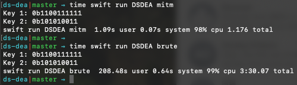

# DS-DEA
_Matt Manzi_  
_Project 2 of CMSC 487, Spring 2020._

An implementation of the Simplified Data Encryption Standard (S-DES) and Double Simplified Data Encryption Algorithm (DS-DEA).

This implementation includes code to run meet-in-the-middle and brute force attacks on the hardcoded set of plaintext/ciphertext pairs listed below:
```
0x42/0x52, 0x72/0xf0, 0x75/0xbe, 0x74/0x69, 0x65/0x8a
```

## Installation and Usage

After cloning the repository, check to ensure you have swift installed on your system with: `swift --version`.  If you do not have version `5.1.4` or greater, instructions to install are [here](https://swift.org/getting-started/#installing-swift).

Once installed, enter the top-level project directory.  Run the code with the following command:
```
swift run DSDEA test|mitm|brute|decrypt
```

## Project Answers

### Found Keys

The keys found for the provided plaintext/ciphertext pairs are:
* Key 1: `0b1100111111`
* Key 2: `0b0101010011`

or in hexadecimal:
* Key 1: `0x33F`
* Key 2: `0x153`

Below are the time for one run of each of meet-in-the-middle and brute force attacks:
* MITM: **1.176 seconds**
* Brute Force: **3:30.07 minutes**



### Decrypted Message

The given ciphertext:
```
0x586519b031aaee9a235247601fb37baefbcd54d8c3763f8523d2a1315ed8bdcc
```
decrypted with the keys found above will produce the (UTF-8-enocded) plaintext:
```
Congratulations on your success!
```

### Weak Keys

There are **4** weak keys for S-DES:
```
0b0000000000
0b1111111111
0b0111101000
0b1000010111
```
or in hexadecimal:
```
0x000
0x3FF
0x1E8
0x217
```
These keys will produce the same round key for all rounds.
